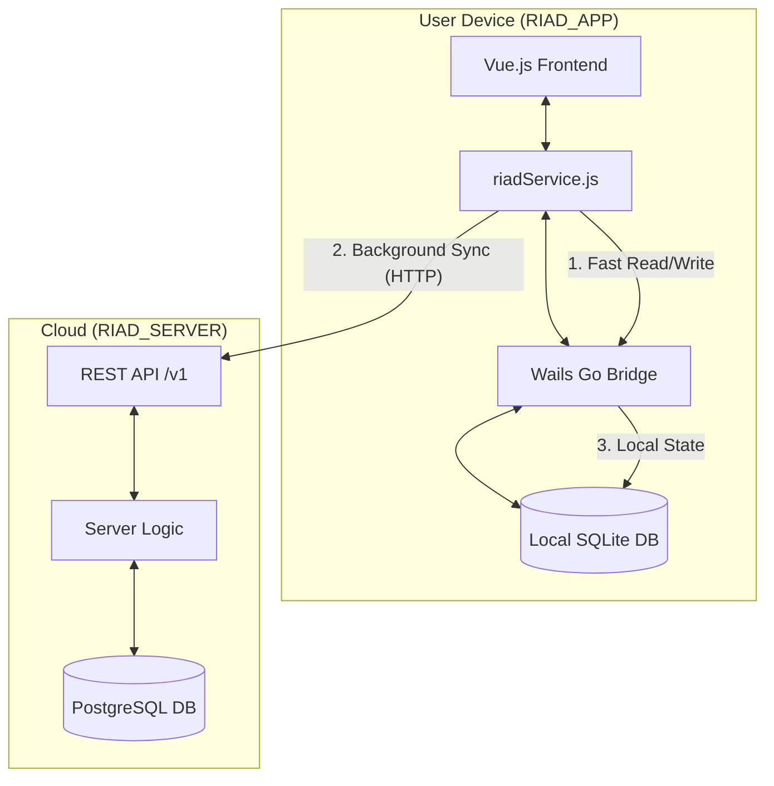

# architecture

This application implements a **Local-First Hybrid Architecture**. The core idea is that the app treats the local device as the primary data source for speed and offline capability, while using the cloud server as the "Global Truth" for synchronization between multiple users.

---

## 🗺️ System Overview

---

## ⚙️ How it Works (The Data Flow)

### 1. Reading Data (The "Mirror" Strategy)
When you open the Room List, the app doesn't wait for the internet:
1.  **Immediate Load**: The frontend asks the Wails Bridge for rooms. The Bridge reads from Local SQLite and returns them instantly.
2.  **Cloud Refresh**: In the background, the app checks if you are online. If yes, it fetches the latest rooms from the RIAD_SERVER.
3.  **Local Update**: Any new or changed rooms from the server are saved into the local SQLite database.
4.  **UI Update**: The screen refreshes with the most recent cloud data.

### 2. Writing Data (The "Pending Sync" Strategy)
When you create a Reservation:
1.  **Local Save**: The app immediately saves the reservation to Local SQLite and marks it with `synced = 0` (Pending). The user sees a "Saved Locally" message.
2.  **Cloud Push**: The app attempts to send the reservation to the RIAD_SERVER via the API.
3.  **Confirmation**: 
    *   **If Online**: The server accepts the data $\rightarrow$ The app updates the local record to `synced = 1`.
    *   **If Offline**: The app does nothing. The record remains `synced = 0`.

### 3. The Sync Engine (The "Bridge")
To ensure no data is lost, a background process runs:
*   It scans the local SQLite for any record where `synced = 0`.
*   Once a connection is restored, it automatically pushes these "pending" records to the server one by one.

---

## 🛠️ Technical Stack

*   **Frontend**: Vue.js 3 + Tailwind CSS 3 (UI/UX).
*   **Bridge**: Wails (Go) - allows JavaScript to call native Go functions.
*   **Local Storage**: go-sqlite (CGO-free SQLite) - a lightweight database file stored on the user's disk.
*   **Server**: Go + PostgreSQL (Centralized data).
*   **Auth**: JWT (JSON Web Tokens) stored in `localStorage` to keep the user logged in.

---

## 🔌 Bridge: Wails (Go)

Wails is the framework that allows the Vue.js frontend (the "skin") to talk to the Go backend (the "brain").

Normally, a website running in a browser is "sandboxed"—it is forbidden from touching your hard drive or reading a local database for security reasons. However, because this is a desktop application, we need that access to make the Local-First architecture possible.

### 1. The Connection
Wails creates a native window that contains a webview (essentially a specialized browser). It then injects a special JavaScript object into the frontend. In our code, this is why we can call:
`window.go.main.RiadService.GetLocalRooms()`

### 2. The Request Flow
When the frontend wants data, the following happens:
1.  **Frontend Call**: The Vue.js code calls a Go method through the bridge.
2.  **Bridge Interception**: Wails catches this call and looks for the matching method in the Go `RiadService` struct.
3.  **Go Execution**: The Go backend executes the native code (e.g., querying the Local SQLite DB).
4.  **Serialization**: Go takes the result (like a list of rooms), converts it into JSON, and sends it back across the bridge.
5.  **JS Promise**: The frontend receives this JSON as a JavaScript Promise, which the Vue.js components then use to update the screen.

### 3. Why this is powerful for RIAD_APP
*   **Performance**: We get the speed of native Go for database operations.
*   **Security**: We keep the database logic hidden in the compiled Go binary.
*   **Simplicity**: We can use modern web tools (Tailwind, Vue) to build a "nice screen" while still having the power of a native desktop app.

---

## 🧠 The Service Layer: Hybrid Orchestrator

The "Service" in this application is a two-tier system consisting of the **Frontend Service** (`riadService.js`) and the **Go Bridge Service** (`RiadService` in Go). Together, they act as the brain that decides whether to use local data or cloud data.

### 🔄 The Read Cycle (Mirroring)
When the UI requests data (e.g., `getRooms()`):
1.  **Instant Local Load**: The service immediately calls the Go Bridge to fetch data from the Local SQLite DB.
2.  **Background Cloud Fetch**: If the device is online, the service simultaneously calls the RIAD_SERVER API.
3.  **Synchronization**: If the server has newer data, the service sends that data to the Go Bridge to update the local SQLite database.
4.  **UI Refresh**: The UI updates with the most accurate cloud data.

### ✍️ The Write Cycle (Pending Sync)
When the user performs an action (e.g., `createReservation()`):
1.  **Local Commit**: The service sends the data to the Go Bridge, which validates it using `pkg/logic` and saves it to Local SQLite with a flag: `synced = 0`.
2.  **Immediate Feedback**: The UI tells the user the action was successful (Local Mode).
3.  **Cloud Attempt**: The service attempts to push the data to the RIAD_SERVER API.
4.  **Confirmation**: 
    *   **Success**: If the API responds `201 Created`, the service tells the Go Bridge to update the record to `synced = 1`.
    *   **Failure/Offline**: If the API is unreachable, the record remains `synced = 0`. It will be pushed later by the Sync Engine.

### 📊 Summary Logic Table

| Scenario | Action | Data Source | Outcome |
| :--- | :--- | :--- | :--- |
| Viewing Rooms (Offline) | Read | Local SQLite | Instant display of last cached data. |
| Viewing Rooms (Online) | Read | SQLite $\rightarrow$ API | Fast load $\rightarrow$ Background update. |
| Booking Room (Offline) | Write | Local SQLite | Saved locally; marked as `synced=0`. |
| Booking Room (Online) | Write | SQLite $\rightarrow$ API | Saved locally $\rightarrow$ Synced to cloud. |
| App Restart (Online) | Sync | SQLite $\rightarrow$ API | All `synced=0` records are pushed. |

---

## 🔄 The Synchronization Mechanism

The synchronization in RIAD_APP works through a **State-Based Flagging system**. It tracks the state of the data using a `synced` column in the local SQLite database.

### 1. The "Pending" State (Write Phase)
Whenever you create or update data locally, the Go backend saves it to SQLite with a default value of `synced = 0`.
*   **Meaning**: `synced = 0` means "This data exists only on this device and the server doesn't know about it yet".

### 2. The "Active Sync" (Online Phase)
When the frontend performs an action while online, it attempts an Immediate Sync:
1.  The `riadService.js` calls the Wails bridge to save the data locally.
2.  It immediately sends a POST request to the RIAD_SERVER.
3.  If the server responds with success, the service calls `MarkAsSynced('table', id)`.
4.  The Go bridge then executes: `UPDATE table SET synced = 1 WHERE id = ?`.

### 3. The "Recovery Sync" (Background Phase)
If the user was offline during the write, the data stays at `synced = 0`. To fix this, the app uses a **Recovery Loop**:
1.  **Detection**: The `syncAll()` function in `riadService.js` asks the Go bridge for all records where `synced = 0` via `GetUnsynced(table)`.
2.  **Processing**: It iterates through every "unsynced" item and attempts to push it to the server API.
3.  **Cleanup**: Once the server accepts the record, it is marked as `synced = 1` locally.

### 💡 Summary Logic Flow

| Step | Action | Local DB State |
| :--- | :--- | :--- |
| 1. Create (Offline) | Save to SQLite | `synced = 0` |
| 2. Connect to Net | Run `syncAll()` | `synced = 0` |
| 3. Push to API | HTTP POST | `synced = 0` |
| 4. Confirm Sync | Update SQLite | `synced = 1` |

> **Conclusion**: This system ensures that the user can never "lose" a reservation just because their Wi-Fi dropped; the app remembers the "pending" state and pushes it automatically when the connection returns
